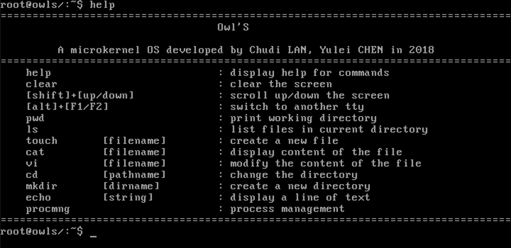
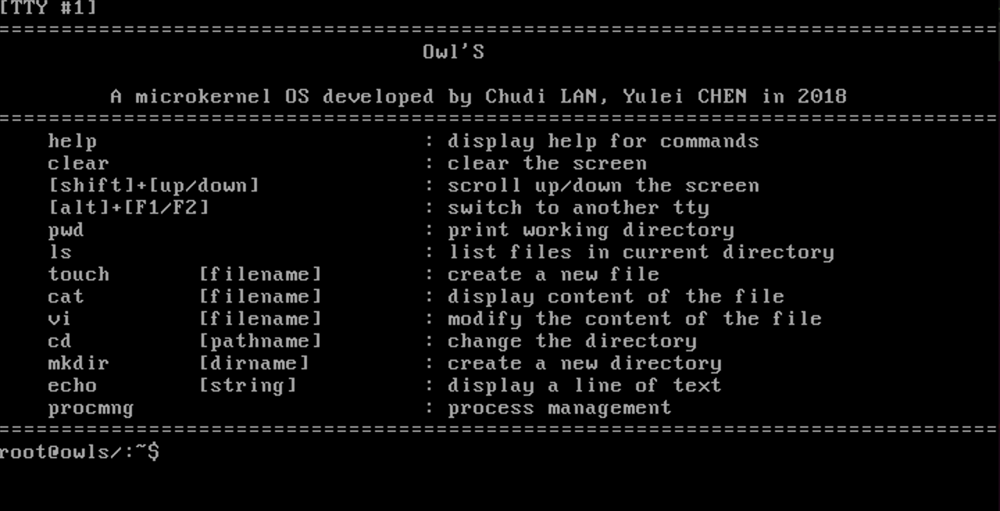
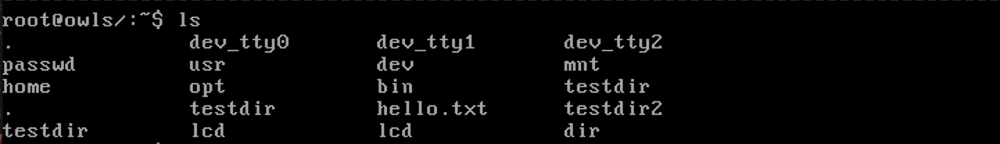
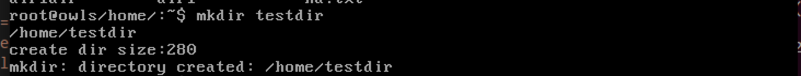
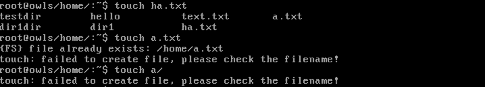
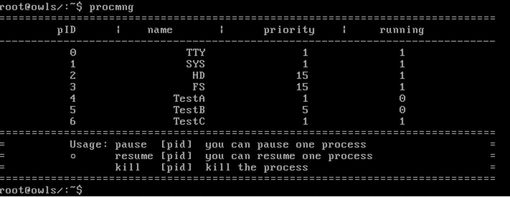
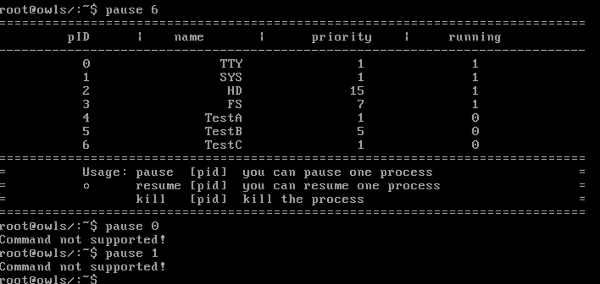
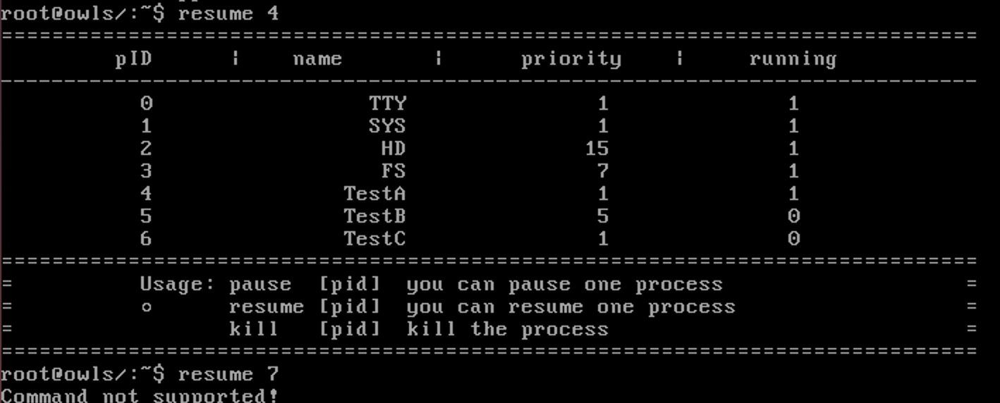

# "Owl'S"操作系统说明文档

[TOC]


## 一、项目简介

### 1.1 队员组成

|  学号   |  姓名  |             分工             | 比例 |
| :-----: | :----: | :--------------------------: | :--: |
| 1552687 | 蓝楚迪 | 搭建环境，项目管理，文件系统 | 57%  |
| 1650257 | 陈雨蕾 |      搭建环境，应用程序      | 43%  |

### 1.2开发环境

* 系统环境：`Ubuntu-14.04.5`
* 编译程序：`nasm-2.13.03`
* 模拟器：`bochs-2.6.9`
* 开发语言：`c`、`assembly`

* 项目管理平台：[GitHub](https://github.com/NSowtril/Owl-S)
### 1.3 "Owl'S"概要
	我们的OS项目参照了Orange‘S提供的源码，在其基础上进行了完善和扩充，取名为Owl’S。
	Owl’S是一个基于微内核的操作系统，系统调用仅仅用于实现一套消息传递机制，我们通过对系统调用进行封装来完成各项任务。我们参照了Orange’S的IPC机制，完成对自定消息的相应处理。
	同时，通过Owl‘S的输入输出系统，实现了开机动画和一些简单的小游戏，并实现多控制台操作。
	Owl‘S对Orange‘S的文件系统进行了改进。Orange’S的文件系统是一个扁平的文件系统，通过封装和利用Orange’S的文件系统管理机制，Owl‘S实现了多级文件系统和文件系统恢复功能，能够记忆并恢复用户文件。在改进文件系统的基础上，实现了一系列文件操作相关的基本指令。

## 二、系统设计说明
* 系统组成结构：
* 引导：` boot/`
* 内核：`kernel/`
* 文件系统：`fs/`
* 代码库：`lib/`
* 头文件集：`include/`

### 2.1 内核
	内核提供对计算机硬件进行安全访问的保护模式，Owl’S是一个**微内核**系统，只提供很小一部分的硬件抽象以及系统调用，这些原语仅仅包扩建立一个系统必须的几个部分（线性地址、进程间通信等）。基于微内核的目的是将系统服务的实现和系统的基本操作规则分离开来。
	由于微内核的结构比较简单，底层操作代码也比较晦涩繁琐，而且Orange‘S已经提供了我们所需的物理抽象，我们就没有将精力放在内核的编写上，而是直接使用了Orange’S提供的内核。
Owl‘S内核提供的服务包括：
* 进程调度
* 进程间通信
* 低级存储器管理
* 中断和陷入处理
* 输入/输出
### 2.2 文件系统


* 管理文件存储空间
* 提供文件结构和存储方法
* 实现文件的控制和存取

## 三、"Owl'S"功能说明

### 3.1 功能概览

```
help				# 显示系统指令帮助
clear				# 清屏
[shift]+[↑/↓]		# 滚屏
[alt]+[Fn]			# 切换控制台
echo [string]		# 打印一行信息

procmng				# 进入进程管理
pause [pid]			# 挂起进程
resume [pid]		# 唤醒进程
kill [pid]			# 终止进程

pwd					# 打印当前工作目录路径
ls					# 打印当前目录下所有文件
touch [filename]	# 在当前目录下创建新文件。filename：文件名
cat [filename]		# 打印filename文件内容。
vi [filename]		# 修改filename文件内容。
mkdir [dirname]		# 新建文件夹
cd [dirname]		# 进入文件夹

guessNum			# 猜数字游戏
2048				# 2048游戏
```

### 3.2 功能说明

#### 控制台相关

* ##### help



* #### clear


* #### [Alt]+[F2]（切换控制台）



> 同时按下[alt]+[F1]或[alt]+[F2]可切换到tty0或tty1

* #### echo


#### 文件系统相关

* ##### ls



* ##### mkdir



* ##### cd


> cd [已存在目录]：进入该文件，提示符前显示当前路径
>
> cd .. ：进入父目录
>
> cd     ：默认进入根目录
>
> cd [不存在目录]：操作失败，提示错误信息
>
> cd [非目录文件]：操作失败，提示错误信息

* ##### touch



> 创建成功：显示当前目录下所有文件
>
> 输入文件名已存在：创建失败，提示错误信息
>
> 输入文件名不合法：创建失败，提示错误信息

* ##### vi


>vi [已存在文件]：请求输入一行文字，按下回车后保存
>
>vi [不存在文件]：修改失败，提示错误信息

* ##### cat


>cat [已存在文件]：打印文件内容
>
>cat [不存在文件]：查看失败，提示错误信息

#### procmng(进程管理)



> 进程管理界面：显示进程的pID、名称、优先级与运行状态

* ##### pause（挂起）



> pause [用户进程ID]：进程挂起，运行状态变为0
>
> pause [系统任务ID]：无法挂起，提示错误信息
>
> pause [不存在的进程ID]：操作失败，提示错误信息

* ##### resume（唤醒）



> resume [用户进程ID]：唤醒进程，运行状态变为1
>
> resume [不存在的进程ID]：操作失败，提示错误信息

## 四、 系统实现
### 4.1 进程管理
微内核将许多OS服务放入分离的进程，而进程通过消息传递调用OS服务。Owl‘S利用中断机制、消息机制构建起进程管理模块。
进程有关的数据结构：

```c
// 进程
struct proc {
    struct stackframe regs;    
    u16 ldt_sel;               
    struct descriptor ldts[LDT_SIZE]; 
    int ticks;                 
    int priority;
    int run_count;          
    u32 pid;                   
    char name[16];       
    int run_state;
    int  p_flags;          
    MESSAGE * p_msg;
    int p_recvfrom;
    int p_sendto;
    int has_int_msg;           
    struct proc * q_sending;   
    struct proc * next_sending;
    struct file_desc * filp[NR_FILES];
};
// 任务
struct task {
    task_f  initial_eip;
    int 	stacksize;
    char    name[32];
};
struct proc proc_table[NR_TASKS + NR_PROCS];	// 进程表
struct task task_table[NR_TASKS];				// 系统任务表
struct task user_proc_table[NR_PROCS];			// 用户进程表
```

时钟中断产生的时候进行进程调度:

```c
void clock_handler(int irq)
{
	if (++ticks >= MAX_TICKS)
		ticks = 0;
	if (p_proc_ready->ticks){
		p_proc_ready->ticks--;
		p_proc_ready->run_count++;
	}
	// 降低优先级
	if(p_proc_ready->run_count >= p_proc_ready->priority/2){
		p_proc_ready->ticks = 0;
		p_proc_ready->priority = p_proc_ready->priority/2;
		if(p_proc_ready->priority == 0){
			p_proc_ready->priority = 1;
		}
		p_proc_ready->run_count = 0;
	}
	if (key_pressed)
		inform_int(TASK_TTY);
	if (k_reenter != 0) {
		return;
	}
	if (p_proc_ready->ticks > 0) {
		return;
	}

	schedule();
}
```

调度程序采用非抢占式优先级调度结合轮转的思想，优先级高的进程将获得更多的时间片，更优先地获得资源和服务，在时间片用完之前进程资源不可抢占，时间片用完后根据进程优先级进行调度。同时，我们将执行了多次的进程优先级降低，以减少饥饿现象。因为我们的进程分为任务（Task）和用户进程（User）两种，分别给予各个进程适当的优先级，基本可以优先照顾高优先级进程的需求。加入进程间通信机制之后，根据进程状态处理阻塞进程。
  ```c
  /* 进程调度程序 */
  PUBLIC void schedule()
  {
  	struct proc*	p;
  	int		greatest_ticks = 0;
  	while (!greatest_ticks) {
  		for (p = &FIRST_PROC; p <= &LAST_PROC; p++) {
  			if (p->p_flags == 0) {
  				if (p->ticks > greatest_ticks) {
  					greatest_ticks = p->ticks;
  					p_proc_ready = p;
  				}
  			}
  		}
  		if (!greatest_ticks)
  			for (p = &FIRST_PROC; p <= &LAST_PROC; p++)
  				if (p->p_flags == 0)
  					p->ticks = p->priority;
  	}
  }
  ```
Owl’S采用的是同步IPC。进程通过发送和接受消息来进行通信，使用系统调用时，需要等内核返回结果之后再继续。
参照Minix，IPC机制的核心在于产生软中断和与其对应的系统调用`sendrec`，调用`sys_sendrec()`函数将`SNED`和`RECEIVE`的消息分别交给`msg_send()`和`msg_receive()`来处理，将处于发送消息和接受消息状态的进程阻塞，只有消息成功发送或接受的进程才能获得CPU资源。

  使用消息机制时，用户进程发送一个消息之后需要马上等待接收一个消息，以便收到内核的返回值。`send_rev()`这个函数将系统调用封装起来，处理用户进程的收发消息。
  在实现IPC的过程中实现了一些必要的函数，包括：

  ```c
  PRIVATE int  msg_send(struct proc* current, int dest, MESSAGE* m);
  PRIVATE int  msg_receive(struct proc* current, int src, MESSAGE* m);
  
  PRIVATE void block(struct proc* p);		// 阻塞一个进程
  PRIVATE void unblock(struct proc* p);		// 唤醒一个阻塞进程
  PRIVATE int  deadlock(int src, int dest);	// 简单判断是否发生死锁
  ```
命令行指令：

* prcomng：

  读取`proc_table[]`中各个进程的信息并打印

* block [pid]：

  调用`block()`阻塞进程

* unblock [pid]：

  调用`unblock()`唤醒进程

### 4.2 终端操作

输入/输出系统是在对键盘和显示器端口的硬件抽象上构建的，我们省去了底层抽象的工作，而是直接利用输入/输出系统来完成对控制台的操作。每个tty指定了一个shell，在每个shell中获取设备文件的描述符`fd_stdin`和`fd_stdout`，通过对缓冲区进行操作可以完成输入输出任务。

重要函数:

```c
void keyboard_read(TTY* tty);					// 键盘输入读取到终端
void in_process(TTY* tty, u32 key);				// 处理终端输入
   
int read(int fd, void *buf, int count);			// 从fd中读取内容
int write(int fd, const void *buf, int count);	// 向fd写内容

void scroll_screen(CONSOLE* con, int dir);		// 滚屏
void clear_screen(int pos, int len);			// 清屏
void select_console(int nr_console);			// 选择控制台
void flush(CONSOLE* con);						// 刷新控制台
```

* 指令读取

  通过`read`读取用户输入，我们的系统设计了最多支持一个参数的指令，用空格来分隔命令和参数。通过匹配输入命令和已有命令集来确定用户命令并执行相应操作。

* 开机动画

  考虑到开机动画对显示器的频繁操作，我们选择了较为底层的函数`disp_color_str()`来打印有颜色的图案，以提高显示器的更新速度。

* help、echo

  调用`printf()`来打印帮助信息以及一行字符串。

* 滚屏

  读取键盘输入并识别出`[shift]`+`[↑/↓]`后，调用`scroll_screen()`来滚动屏幕。

* 清屏

  将清除显存、重置显存偏移和重置光标的操作封装成一个动作。

  ```c
  void clear() {	
      clear_screen(0, console_table[current_console].cursor);	
      console_table[current_console].crtc_start = console_table[current_console].orig;
      console_table[current_console].cursor = console_table[current_console].orig;
  }
  ```

* 控制台切换

  每个tty任务指定了一个`console`，读取到键盘输入`alt`+`Fn`后调用`select_console()`和`flush()`来切换控制台。

  Owl‘S设置了tty0和tty1两个终端来展示多终端机制。
### 4.3 文件系统
我们改进了Orange‘S的文件系统，使其成为多级目录结构。
重要数据结构：

```c
// 超级块
struct super_block {
    u32 magic;        		/**< Magic number */
    u32 nr_inodes;    		/**< How many inodes */
    u32 nr_sects;     		/**< How many sectors */
    u32 nr_imap_sects;    	/**< How many inode-map sectors */
    u32 nr_smap_sects;    	/**< How many sector-map sectors */
    u32 n_1st_sect;   		/**< Number of the 1st data sector */
    u32 nr_inode_sects;   	/**< How many inode sectors */
    u32 root_inode;       	/**< Inode nr of root directory */
    u32 inode_size;       	/**< INODE_SIZE */
    u32 inode_isize_off;  	/**< Offset of `struct inode::i_size' */
    u32 inode_start_off;  	/**< Offset of `struct inode::i_start_sect' */
    u32 dir_ent_size;     	/**< DIR_ENTRY_SIZE */
    u32 dir_ent_inode_off;	/**< Offset of `struct dir_entry::inode_nr' */
    u32 dir_ent_fname_off;	/**< Offset of `struct dir_entry::name' */

    int sb_dev;     		/**< the super block's home device */
};
// i-node
struct inode {
    u32 i_mode;     	/**< Accsess mode */
    u32 i_size;     	/**< File size */
    u32 i_start_sect;   /**< The first sector of the data */
    u32 i_nr_sects; 	/**< How many sectors the file occupies */
    u8  _unused[16];    /**< Stuff for alignment */

    int i_dev;
    int i_cnt;      	/**< How many procs share this inode  */
    int i_num;      	/**< inode nr.  */
};
// 目录项
struct dir_entry {
    int   inode_nr;       			/**< inode nr. */
    char  name[MAX_FILENAME_LEN]; 	/**< Filename */
};
// 文件描述符
struct file_desc {
    int     fd_mode;    		/**< R or W */
    int     fd_pos;     		/**< Current position for R/W. */
    struct inode*   fd_inode;   /**< Ptr to the i-node */
};

struct file_desc	f_desc_table[NR_FILE_DESC];
struct inode		inode_table[NR_INODE];
struct super_block	super_block[NR_SUPER_BLOCK];
struct inode *		root_inode;
```

重要函数：

```c
// 文件系统接口
int open(const char *pathname, int flags);			/* 打开/创建文件 */
int close(int fd);									/* 关闭文件描述符 */
int ls(const char *pathname);						/* 列出当前目录下的文件 */
int cd(const char *pathname);						/* 切换目录 */
int mkdir(const char *pathname);					/* 创建目录 */
int unlink(const char * pathname);					/* 删除文件 */

// fs/main.c
void task_fs();
void sync_inode(struct inode * p);

// fs/open.c: 消息处理
int do_open();										/* 处理OPEN消息 */
int do_ls();										/* 处理LS消息 */
int do_mkdir();										/* 处理MKDIR消息 */
int do_cd();										/* 处理CD消息 */
int do_close();
int do_unlink();
int do_rdwt();										/* 处理READ和WRITE消息 */

struct inode* create_file(char * path, int flags);	/* 创建文件 */
struct inode* create_dir(char * path);				/* 创建目录 */
struct inode* change_dir(char * path);				/* 切换目录 */
struct inode* new_inode(int dev, int inode_nr, int start_sect, int imode);
void new_dir_entry(struct inode *dir_inode,int inode_nr,char *filename);

// fs/misc.c
struct dir_entry * find_entry(char *path);			/* 查找目录项 */
int search_file(char * path);						/* 查询文件inode号 */
int strip_path(char * filename, const char * pathname, struct inode** ppinode);	/* 从全路径中提取文件名 */

```

因为文件系统的操作涉及到读写硬盘，用户进程需要内核的协助，这就要进行消息传递。比如Orange'S在创建文件的时候，进程会发送`OPEN`这个消息并且在消息中设置标识`CREAT`来表示创建，同时通过消息传递文件名和路径等参数，当文件系统的主循环监听到这个消息后调用`do_open()`函数来处理这个操作，进而调用`create_file()`以及往下的一些修改全局变量的函数。

我们仿照Orange'S的这个方法，添加了消息`LS`、`MKDIR`和`CD`，仿照`do_open()`等函数实现了对应的的`do_xxx`函数。

```c
        switch (msgtype) {
        case OPEN:
            fs_msg.FD = do_open();
            break;
        case CLOSE:
            fs_msg.RETVAL = do_close();
            break;
        case READ:
        case WRITE:
            fs_msg.CNT = do_rdwt();
            break;
        case UNLINK:
            fs_msg.RETVAL = do_unlink();
            break;
        case RESUME_PROC:
            src = fs_msg.PROC_NR;
            break;
        case LS:
            fs_msg.RETVAL = do_ls();
            break;
        case MKDIR:
            fs_msg.RETVAL = do_mkdir();
            break;
        case CD:
            fs_msg.RETVAL = do_cd();
            break;
        default:
            dump_msg("FS::unknown message:", &fs_msg);
            assert(0);
            break;
        }
```

我们为了实现多级文件系统，增加了支持创建子目录的功能。目录文件和普通文件的处理本质上没有区别。只是在其inode里添加了一个`imode`的标识来区别普通文件和目录文件，同时在数据块中存放的是该目录下的子目录项，文件系统的操作都是基于当前目录的inode信息。


## 五、小结

	通过本次课程设计我们的开发小组有不少的收获。
	
	首先课本上的理论不再是死板的概念，虽然我们没有真的像参考书的标题——”OS from scratch“那样一行行代码地敲出来，但是我们跟着教材一章章地研究代码、运行程序，把各个模块整合起来，不仅对操作系统的机制理解得更加透彻，也很有成就感。
	
	当然，我们也反思了项目的不足。从规范的角度，应该为文件系统的操作实现完备的消息传递和处理机制，但我们可能对这套机制还有理解不到位的地方，导致出现较多的bug，所以我们只选取了几个功能来实现IPC，这也导致了文件系统一定程度上的不健壮。同时，由于对一些底层操作不够熟悉，我们只是基于源码中一些比较简单的抽象来开发，导致一定的局限性，一些功能没有办法如愿地实现。
	
	总的来说，虽然还有诸多的不完善，但我们的操作系统已经具备了一个微内核操作系统的基本组件。我们通过项目把一学期的理论知识付诸实现，这个过程会成为未来难忘的宝贵经历。

## 六、参考文献

Orange S:一个操作系统的实现》于渊  ISBN: 9787121084423

鸟哥的Linux私房菜：基础学习篇》鸟哥 ISBN: 9787115226266